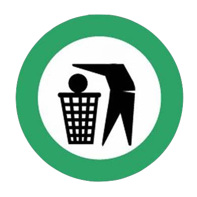

<a href="https://en.wikipedia.org/wiki/Audio_mastering">
<h1> <u>UNMASTERED </u></h1>
</a>
<h3> A New <a href="https://www.popsugar.com/celebrity/Kim-Kardashian-Talks-About-Kanye-Trump-Jimmy-Kimmel-45118370"><u>Political</u></a> Series By <a href="mailto:thecrackemcee@gmail.com"><u>The Crack Emcee</u></a></h3>
  

<h2> 1. A <a href="https://reason.com/blog/2018/04/27/black-people-dont-have-to-be-democrats"><u>Message</u></a> To Kanye </h2>

<audio controls>
  <source src="music/kayne.mp3" type="audio/mpeg">
  <source src="music/kayne.ogg" type="audio/ogg">
</audio>

 

    
 
 
 

    
 

